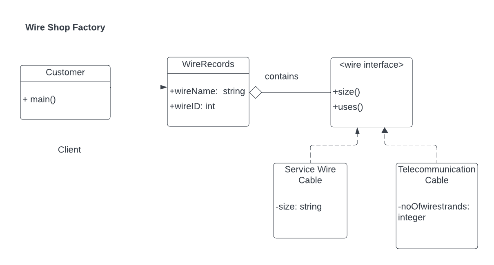

## Problem Scenario
Implement factory design pattern using Wire as the factory interface. The interface implements two methods: size() and uses().

Service Wire Cable and Telecommunication are concrete objects that implements Pet interface.

WireRecords holds attributes such as wireName, wireID, and Wire.

Customer would be the client object.

Refer to the UML Class Diagram

## UML Class Diagram

